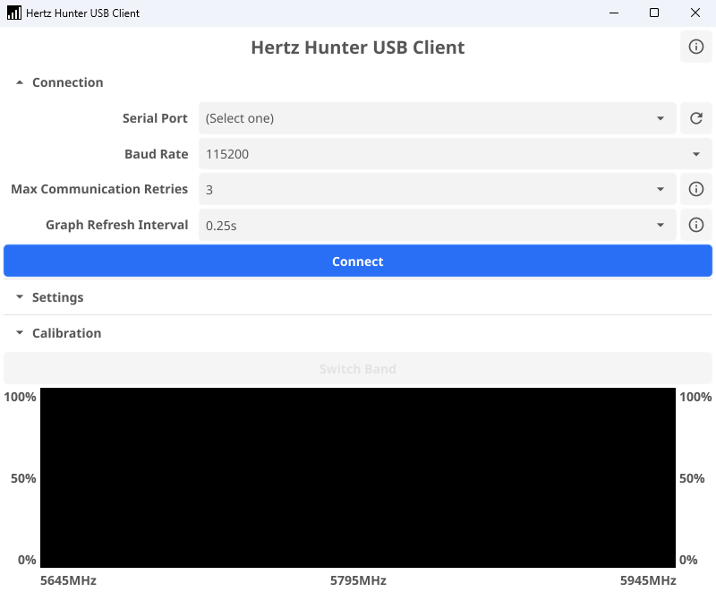
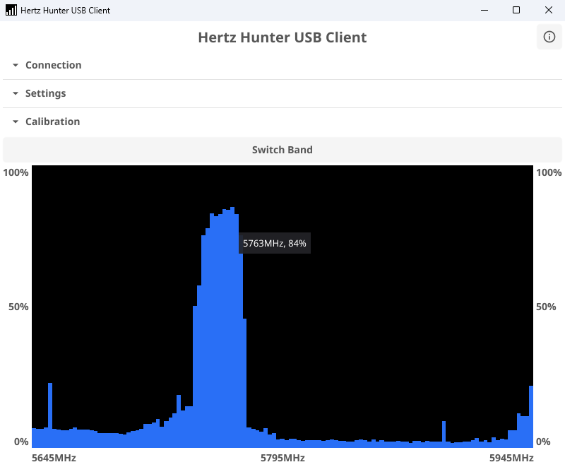
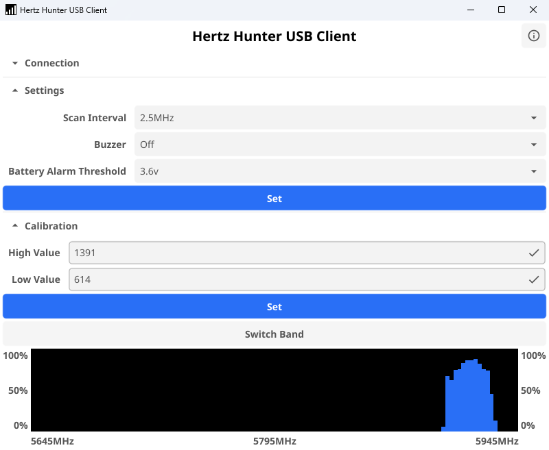

# Hertz Hunter USB Client

A USB client for the [Hertz Hunter](https://github.com/odddollar/Hertz-Hunter) spectrum analyser. Uses Hertz Hunter's USB serial communication feature to request data from the device and displays it visually on a computer. This program provides almost full control over a connected Hertz Hunter device through a desktop app interface.

For further information on the capabilities of the Hertz Hunter project, please see the [main repository](https://github.com/odddollar/Hertz-Hunter). The USB serial documentation and schema can be found [here](https://github.com/odddollar/Hertz-Hunter/blob/master/USB.md).

## Features

- Connecting to a Hertz Hunter device via a configurable serial port and baud rate
- Robust communication protocol to minimise disconnection errors
- Interactive graphing of RSSI data
  - Mouse over the graph to show a tooltip with the hovered frequency and its live signal strength
- Configurable interval to poll data from the device to update the graph
- Battery voltage continuously displayed in the about window
- Automatic recognition if the connected device doesn't have battery monitoring setup
- Ability to change and set all settings
  - `Scan Interval`, `Buzzer`, and `Battery Alarm Threshold` are all available
- Manually set exact high and low RSSI calibration values
  - Refer to [here](https://github.com/odddollar/Hertz-Hunter/blob/master/USAGE.md#rssi-calibration) and [here](https://github.com/odddollar/Hertz-Hunter/blob/master/USB.md#eventgetlocationcalibration) for explanations of Hertz Hunter's RSSI calibration system
- Switch scanning between high and low bands
- Collapsible UI elements to maximise display area for the RSSI graph

## Connecting

1. Plug the Hertz Hunter device into the computer with a USB cable
2. Open the `USB serial` menu from the `Advanced` menu on the device. Instructions [here](https://github.com/odddollar/Hertz-Hunter/blob/master/USAGE.md)
3. Launch the USB client application
4. Refresh the serial port list (if necessary) and select the correct one
5. Select the same baud rate as displayed on Hertz Hunter's screen
6. Select the `Graph Refresh Interval`. The default works well, but can be adjusted if desired
7. Click `Connect`

## Building

This program is built using the [Go](https://go.dev/) programming language and the [Fyne](https://fyne.io/) UI framework. To setup a development environment, you'll need to install:

- [Go](https://go.dev/)
- A C compiler ([w64devkit](https://github.com/skeeto/w64devkit), [Cygwin](https://cygwin.com/), [MSYS2](https://www.msys2.org/), or similar)
- [Fyne's tooling](https://docs.fyne.io/started/packaging/)
  - Can be installed with `go install fyne.io/tools/cmd/fyne@latest`
- (Optional) [UPX](https://github.com/upx/upx)
  - Fyne projects can be large when compiled. Not necessary, but nice to have

Clone this repository:

```bash
git clone https://github.com/odddollar/Hertz-Hunter-USB-client.git
cd Hertz-Hunter-USB-client
```

Run for testing/development with:

```bash
go run .
```

Package for release with:

```bash
fyne package --release
```

(Optional) Use UPX to transparently compress the executable:

```bash
upx --ultra-brute "Hertz Hunter USB Client.exe"
```

## Screenshots

<div align="center">
    <br><br>
    <br><br>
    
</div>
